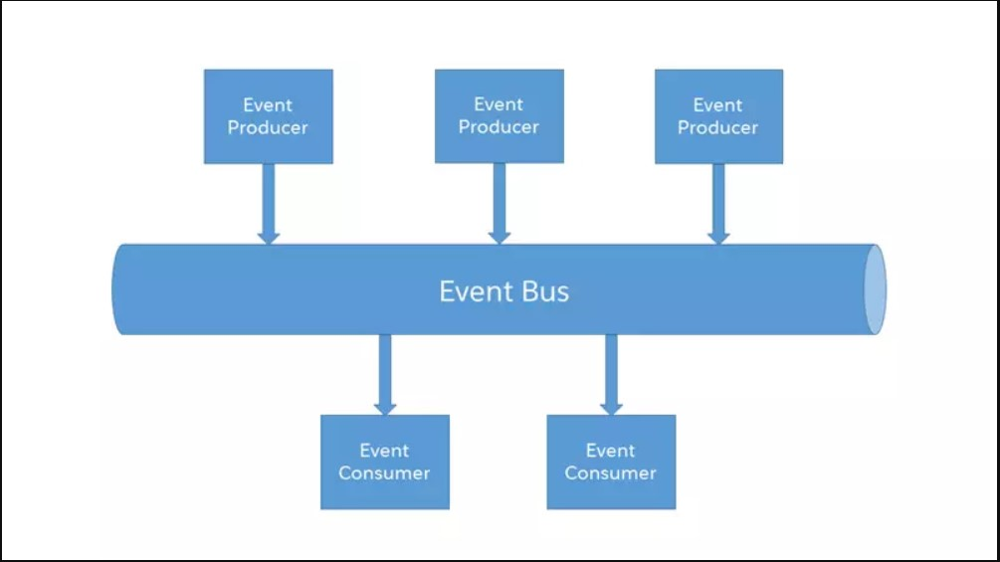

# jinternals-event-bus

This is a simple framework for implementing event-bus pattern.

#### Supported Brokers :
 
* ActiveMQ
* RabbitMQ
* Kafka(Work In Progress)

#### Example: 

https://github.com/jinternals/jinternals-event-bus-demo

### Links:

https://www.enterpriseintegrationpatterns.com/patterns/messaging/MessageBus.html  
